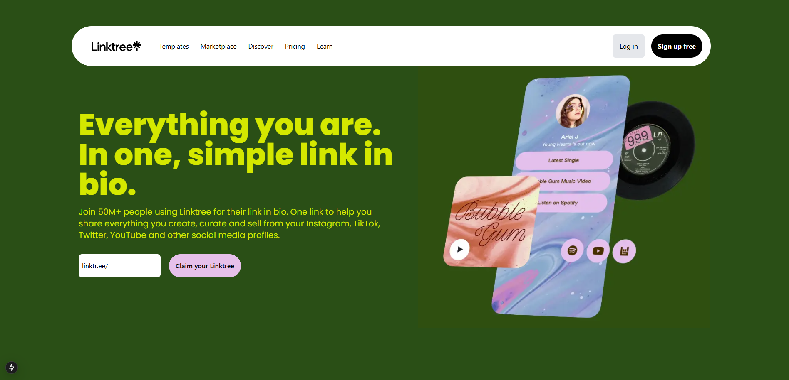

# Linktree Clone in Next.js

A **Linktree Clone** built with **Next.js**, allowing users to create a single page that contains multiple links to their social media, websites, and other platforms.

## 🚀 Features
- User profile setup
- Dynamic link management (add, edit, delete)
- Responsive UI for mobile & desktop

## 📚 Key Learnings
During this project, I learned:
- Next.js for server-side rendering and API routes
- Managing state using React hooks & context API
- Working with Tailwind CSS for fast styling
- Handling authentication & database integration
- Deploying a Next.js app for production

## 🛠️ Tech Stack
- **Frontend:** Next.js, React, Tailwind CSS
- **Backend:** Next.js API Routes
- **Database:** MongoDB

## 📸 Project Visuals


## ⚙️ How to Run Locally

### Prerequisites
- Node.js installed
- MongoDB setup for database
- Environment variables configured (.env.local)

### Steps
1. **Clone the repository**
   ```sh
   git clone https://github.com/yourusername/linktree-clone.git
   cd linktree-clone
   ```

2. **Install dependencies**
   ```sh
   npm install
   ```

3. **Set up environment variables** (create `.env.local` and add necessary keys)
   ```env
   MONGODB_URI=
   NEXT_PUBLIC_HOST=https://localhost:3000
   ```

4. **Run the development server**
   ```sh
   npm run dev
   ```
   The app will be available at `http://localhost:3000`


## 🤝 Contributing
Feel free to submit issues or pull requests to improve the project!

## 📜 License
This project is open-source and available under the **MIT License**.
